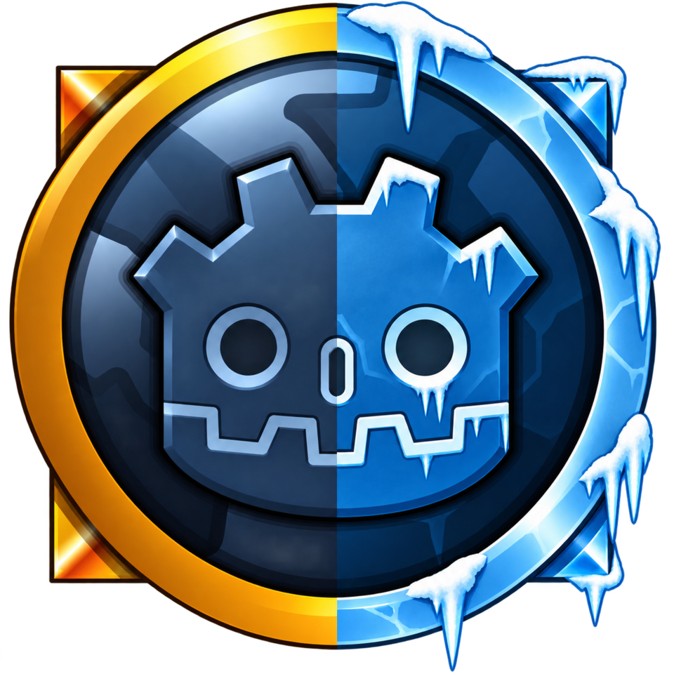

<p align="center">
  
</p>

# WoWdot

Godot clients for classic World of Warcraft servers.

https://bearlikelion.github.io/WoWdot/

| Client | Game version | Server | Status |
| --- | --- | --- | --- |
| [WoWGD](clients/wowgd) | 1.12.1 (build 5875) | vMaNGOS | Playable |
| [WrathGD](clients/wrathgd) | 3.3.5a (build 12340) | AzerothCore | Walks around |

WoWdot ships no Blizzard data.
Each client reads the MPQ archives from your own game install and talks to whatever server you point it at.

## Layout

```text
extension/       C++ GDExtension: login, network protocol, MPQ access and WoW file formats
shared/wowdot/   The addon both clients load; built libraries land in its bin/
shared/game/     GDScript both clients load: interface, world and gameplay
clients/wowgd/   The 1.12.1 client
clients/wrathgd/ The 3.3.5a client
docs/            Provenance and license audit
website/         Project site, built by website/build.sh
packaging/       Release zip contents and publish.sh
```

Both clients link `shared/game/` in as `game/`, so `res://game/...` is the same path in each.
Each client keeps its own data tables, expansion setting and `Data` folder.

## Building

Needs Godot 4.7, SCons and a C++20 compiler.
Every library is a submodule compiled in, so there is nothing to install from the system.

```sh
git clone --recursive https://github.com/bearlikelion/WoWGD.git WoWdot
cd WoWdot/extension
scons -j"$(nproc)" target=template_debug
```

For Windows, cross-compile with mingw-w64:

```sh
scons -j"$(nproc)" platform=windows target=template_release
```

On Windows, clone with `git config core.symlinks true` (Developer Mode on), or copy `shared/wowdot` over each `clients/*/addons/wowdot` link.

## Running

Open `clients/wowgd` in Godot, set **Project Settings > wowgd > client_data_dir** to your 1.12.1 client's `Data` folder, and run.
Exported builds read the `Data` folder next to their executable.

## Releases and the site

`packaging/publish.sh <tag>` zips the local export and attaches it to a GitHub release.
Releases are built locally because the export encrypts the pck, which only templates compiled with the key can load.
The site in `website/` is plain HTML; `.github/workflows/pages.yml` publishes it to GitHub Pages on every push to `main`.

## Thanks

[WoWee](https://github.com/Kelsidavis/WoWee), [wowdev.wiki](https://wowdev.wiki/Main_Page) and [benilla](https://github.com/samwhosung/benilla), a from-scratch 1.12.1 client in Rust and Bevy.

## License

WoWdot will be MIT licensed, see [LICENSE](LICENSE), [NOTICE.md](NOTICE.md) and [CONTRIBUTING.md](CONTRIBUTING.md).
