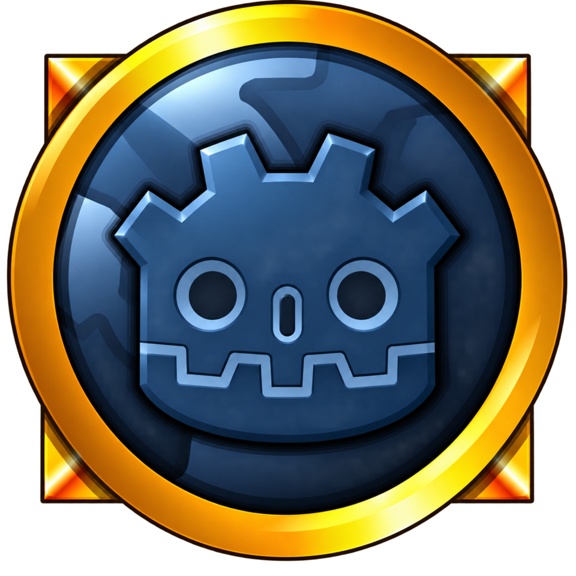

  

# WoWGD

A Godot 4.7 client for World of Warcraft 1.12.1 (build 5875) that plays on [vMaNGOS](https://github.com/vmangos/core).
It reads the stock client's MPQs at runtime and ships no Blizzard data.

## Status

Playable: you can log in, create a character, quest, fight, loot, group, train and fly on an unmodified vMaNGOS server.

| Area | Working |
| --- | --- |
| Login | Account login, realm list, character select, create and delete, loading screen, glue music. Passes realmd's default `StrictVersionCheck`. |
| World | Streaming terrain, WMOs and doodads, water, sky with day and night from Light.dbc, weather, zone music and ambience. |
| Characters | Skin compositing, hair and facial hair, equipment on the model, sheathing, mounts, 3D portraits. |
| Movement | Movement relays, jumping, falling, swimming, flights on taxi splines, dead reckoning for other players. Server speed changes, roots, knockbacks and water walking are applied and acknowledged. |
| Zoning | Continents, dungeons and portals, with the loading screen and a clean sweep of the old map's objects. |
| Death | Release, corpse location and reclaim, resurrect offers from other players, and the spirit healer. |
| Combat | Targeting, auto attack, spell casts with cooldowns and the GCD, buffs and debuffs, floating combat text, combat log. |
| HUD | Action bars with pages, side bars and the stance bar, player, target and target of target frames, cast bar, minimap, tooltips, reputation watch bar. |
| Chat | Say, yell, party, guild and whispers, channels with /join and numbered commands, emotes such as /dance. |
| Panels | Character sheet, bags, spellbook, talents, quest log and quest watch, skills, reputation, world map, game menu, video and sound options. |
| NPCs | Gossip, quest dialogs and markers, vendors with buyback and repair, class trainers, flight masters. |
| Groups | Party invites, party frames, loot window, quest sharing. |

## Requirements

- Godot 4.7 and the `wowdot` extension built from [`extension/`](../../extension) (see the [top-level README](../../README.md#building)).
  `shared/wowdot/wowdot.gdextension` has `reloadable = true`, which needs an editor with the extension instance-binding fix; on a stock editor set it to `false`.
- A 1.12.1 (build 5875) client folder: `Data` with its MPQs, plus `WoW.exe`, `fmod.dll`, `ijl15.dll`, `dbghelp.dll` and `unicows.dll` beside it.
  realmd hashes those five files into the login proof, so they must sit in the folder that holds `Data`.

## Server setup

WoWGD targets the latest vMaNGOS `development` commit with no source changes and the shipped defaults for anything the client can see.

1. Build vMaNGOS with its default CMake options (`SUPPORTED_CLIENT_BUILD` defaults to 1.12.1).
   Passing `-DSUPPORTED_CLIENT_BUILD=5875` also works, but CMake then rewrites the tracked `src/shared/Progression.h` and leaves the tree dirty.
2. Create the `realmd`, `characters`, `mangos` and `logs` databases, load the schemas, the world database from [brotalnia/database](https://github.com/brotalnia/database) and the migrations, as vMaNGOS's install guide describes.
3. Run vMaNGOS's `MapExtractor` from the client folder, and point `DataDir` in `mangosd.conf` at the extracted `dbc` and `maps` (vmaps and mmaps are optional).
4. Copy `realmd.conf.dist` and `mangosd.conf.dist` and change only the database connections and paths.
   Keep `StrictVersionCheck = 1`.
5. Set the realm's address in `realmd.realmlist`, then create an account from the mangosd console: `account create wowgd wowgd`.
6. For the checks in [`tests/`](tests), which use GM commands, run `account set gmlevel wowgd 6`.

## Running

Open this folder in Godot, set **Project Settings > wowgd > client_data_dir** to the client's `Data` folder, and run.
Command-line options after `--` fill the login screen for one run without saving: `--realm=<address>`, `--account=`, `--password=` and `--character=` (logs straight in; without `--character` it enters the first character).

## Exporting

`export_presets.cfg` has Linux and Windows presets that write to `export/wowgd/`.
An exported build reads `Data` next to its executable, so players copy the export into their 1.12.1 folder.
Build the extension's release libraries first: `scons target=template_release`, and `scons platform=windows target=template_release` (mingw-w64) for Windows.

## Checks

The checks in `tests/` log into a local server as `wowgd` / `wowgd` and use the account's first character.
Run one with `godot --headless --path . tests/glue_check.tscn` (or without `--headless` for the ones that capture screenshots); each prints `<name>: OK` or the number of failures.
`party_check.sh` and `remote_movement_check.sh` also need a second account, `wowgd2` / `wowgd2`, and `death_check.sh` makes and removes its own character.
A character left dead cannot use chat, which silently breaks the GM commands later checks rely on; revive it from the server with `bin/soap.sh "revive <name>"`.

| Check | Covers |
| --- | --- |
| `glue_check` | Login, realm list, character create and delete. |
| `play_check`, `targeting_check`, `combat_check`, `combat_log_check` | Entering the world, targeting and combat. |
| `panels_check` | Every panel, quest add and abandon. |
| `npc_check`, `npc_services_check.sh` | Gossip, quests, vendor, trainer, flights. |
| `loot_check`, `party_check.sh` | Loot and parties. |
| `remote_motion_check`, `remote_movement_check.sh` | Other players' movement. |
| `movement_check`, `swim_check` | Forced speed, root, water walk, feather fall and knockback; swimming. |
| `stance_check`, `target_of_target_check` | The stance bar and the target of target frame. |
| `emote_check`, `channel_check` | Slash emotes and chat channels. |
| `zoning_check`, `death_check.sh` | Zoning between maps; dying, releasing and resurrecting. |
| `sheath_check`, `sky_check` | Sheathing, sky, light and weather. |
| `audio_check` | Audio, with no server needed. |

## Still to do

In the order they are planned:

| Milestone | Work |
| --- | --- |
| M3 NPC services | Bank, mailbox, auction house, then stable, petition and tabard. |
| M4 social | Trade, duel, group loot rolls, ready check, friends and ignore, guild, the stock dropdown menu, chat tabs and bubbles. |
| M5 pets | Pet frame, pet action bar, pet spellbook, hunter and warlock pets. |
| M6 visuals | M2 particles, ribbons and texture animation, spell visuals and projectiles, WMO liquids, transports. |
| M7 polish | Key binding UI, interface options, starting outfit on the create preview, race and class tooltips, realm list scrolling past 18 realms, doodad LOD, footstep sounds by terrain, the corpse marker on the map and minimap, the breath meter underwater. |

After that come the content tools: custom spells, creatures, items and quests as Godot Resources exported to the vMaNGOS database, and map editing in the Godot editor with an exporter to vMaNGOS `.map` files.

## References

[wowdev.wiki](https://wowdev.wiki/Main_Page) documents the client's file formats and much of the protocol, mostly for 3.3.5a, so check each page's version notes before applying it to 1.12.1.
For packet layouts the vMaNGOS source is the authority, since it is what the server sends.
