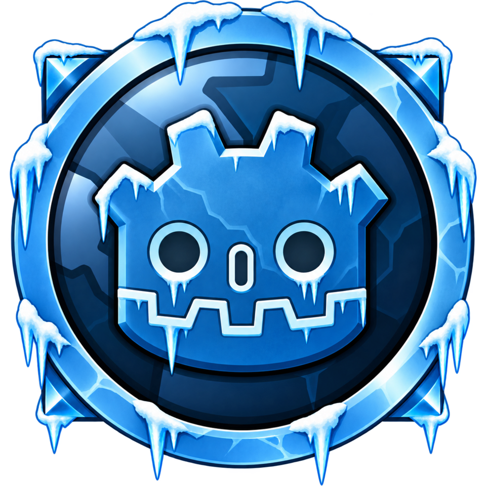

  

# WrathGD

A Godot 4.7 client for World of Warcraft 3.3.5a (build 12340) that will play on [AzerothCore](https://github.com/azerothcore/azerothcore-wotlk).
Like [WoWGD](../wowgd), it will read the stock client's MPQs at runtime and ship no Blizzard data.

## Status

Scaffold only.
The project has its `project.godot`, the shared `wowdot` extension linked in as `addons/wowdot`, and the 3.3.5a opcode, update field and DBC layout tables in `data/wotlk/` (from WoWee, MIT).
There are no scenes or scripts yet.
Work starts after WoWGD's remaining milestones (see [its README](../wowgd/README.md#still-to-do)).

## Requirements

- Godot 4.7 and the `wowdot` extension built from [`extension/`](../../extension) (see the [top-level README](../../README.md#building)).
- A 3.3.5a (build 12340) client folder with its `Data` directory: `common.MPQ`, `common-2.MPQ`, `expansion.MPQ`, `lichking.MPQ`, the `patch*.MPQ` files and the locale folder (for example `enUS/`).
  Set **Project Settings > wowgd > client_data_dir** to that `Data` folder.

## Server setup

WrathGD targets the latest AzerothCore `master` commit with no source changes, no modules, and the shipped defaults for anything the client can see.
A fork with custom modules is not a valid test server.

1. Clone `azerothcore-wotlk` and build it by following AzerothCore's installation guide; the repository ships a Docker Compose setup.
2. Extract the client data with AzerothCore's own tools (`map_extractor`, then optionally `vmap4_extractor`, `vmap4_assembler` and `mmaps_generator`) from your 3.3.5a client folder, and point `DataDir` in `worldserver.conf` at the result.
3. Copy `authserver.conf.dist` and `worldserver.conf.dist` and change only the database connections and paths.
4. Set the realm's address in `acore_auth.realmlist`, then create an account from the worldserver console: `account create wowgd wowgd`.
5. For GM-driven checks, run `account set gmlevel wowgd 3 -1`.

## Still to do

Most of the protocol and file format code is already in the vendored WoWee sources under `extension/wowee/`, where WotLK is the default path.
The work is making the extension and the game code pick the expansion instead of assuming vanilla.

### Extension (`extension/src`)

| Area | Work |
| --- | --- |
| Profile | `WowSession` hard-codes build 5875, version 1.12.1, the legacy vanilla realm list, the classic packet parsers and `res://data/classic/`; `WowDBC` hard-codes the classic layouts. Select these per client. `wowee/include/game/game_utils.hpp` was rewritten to always answer classic and needs the same switch. |
| Auth and header | The WotLK auth session, 40-byte auth challenge and RC4 header cipher exist in WoWee and are chosen by build number once the build is right. |
| Large packets | The world socket rejects the 5-byte header AzerothCore uses for packets over 0x8000 bytes, which large update objects need. |
| Hand-parsed packets | `wow_session.cpp` parses these in the vanilla layout: learned spells (u16 ids), cast failed, spell cooldown, aura duration (WotLK has `SMSG_AURA_UPDATE` instead), quest query, quest giver status, gossip options, vendor, trainer and taxi lists, chat (vanilla chat type numbering), movement relays and the teleport ack (no `flags2`, vanilla flag values), and the flying spline flag. |
| Constants | Character create and delete result codes (47 and 71 in WotLK), and Blood Elf and Draenei in the faction check. |
| MPQs | `WowArchive` opens the vanilla archive list; WotLK needs common, common-2, expansion, lichking, the patches and the locale folder's archives, in WotLK priority order. |
| Models | M2 version 264 keeps its geometry in `.skin` files and some animations in `.anim` files; `wow_models.cpp` calls only `M2Loader::load()`, so every WotLK model comes out empty until it also calls `loadSkin()` and `loadAnimFile()`. |
| Water | ADT liquids are MH2O with LiquidType.dbc ids instead of MCLQ's four types, so the liquid material mapping needs the new ids. |

### Game code

WoWGD's `game/` folder is about 15,000 lines of GDScript, and roughly 75 to 85 percent of it can be reused once it moves somewhere both clients load.

- **Sharing.** The code lives in `clients/wowgd/game/` today, and there is no profile boundary between vanilla and WotLK yet; it should be shaped by the real differences found while bringing this client up.
- **Data tables.** `data/wotlk/dbc_layouts.json` lacks tables the game reads (ChrRaces, ChrClasses, SpellCastTimes, SpellDuration, SpellRadius, HelmetGeosetVisData, QuestSort, WorldMapOverlay and others), and `update_fields.json` has 62 entries where WoWGD uses 324.
- **Removed fields.** `UNIT_FIELD_AURAS`, `UNIT_VIRTUAL_ITEM_*` and the 12-field `PLAYER_VISIBLE_ITEM` stride are gone in WotLK, and quest log slots grow from 3 fields to 5.
- **Raw packets.** 14 scripts decode payloads in the vanilla layout (loot, merchant, party, taxi, talents, skills, combat events, NPC dialogs and others).
- **Constants.** Movement flag values, fixed DBC column numbers (Spell, SoundEntries, Light), and the character create screen's 8 races without Death Knights.
- **UI.** The 3.3.5a FrameXML differs from 1.12's, so `tools/framexml/convert.py` has to run against the WotLK interface files, with a `frames.json` of its own.

### Order

1. Extension profile, auth and the MPQ list: log in and reach character select against AzerothCore.
2. Large packets, update fields and movement: enter the world and move.
3. M2 v264 skins and MH2O water: render the world and characters.
4. Move the shared game code out of `clients/wowgd`, then port the UI.

## References

[wowdev.wiki](https://wowdev.wiki/Main_Page) documents the client's file formats and much of the protocol, and most of it is written against 3.3.5a (12340): M2 with `.skin` and `.anim`, ADT/v18 with MH2O, WMO and the WotLK DBC tables.
For packet layouts the AzerothCore source is the authority, since it is what the server sends.
