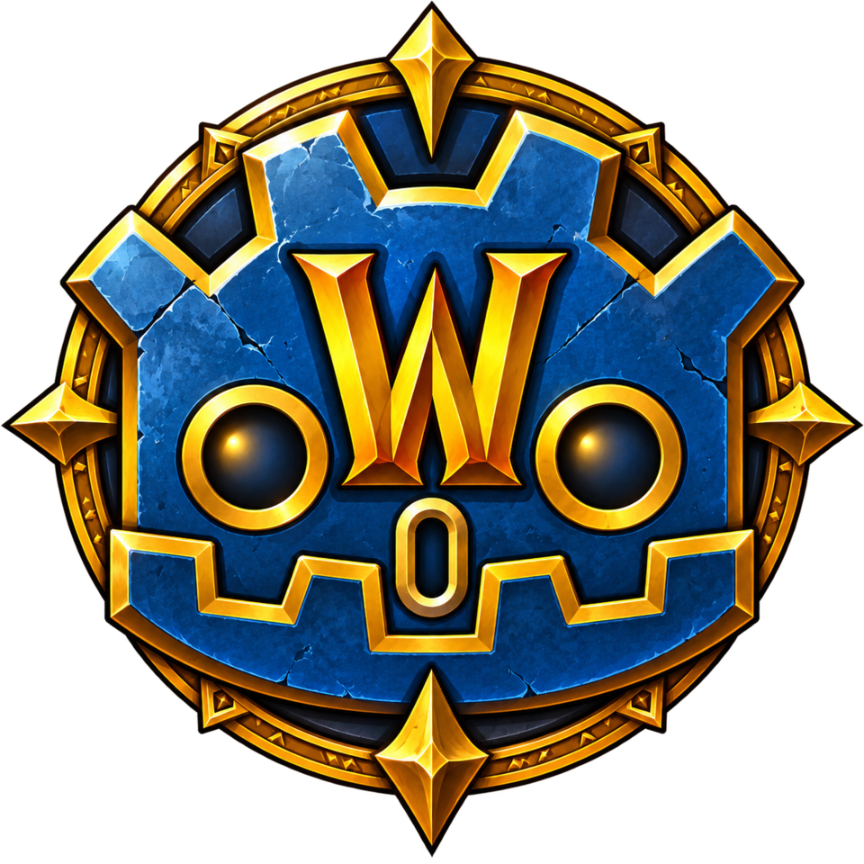

<p align="center">
  
</p>

# wowdot extension

The C++ GDExtension behind the WoWdot clients.
It reads a stock World of Warcraft install (MPQ archives, DBC tables, BLP textures, M2 and WMO models, ADT terrain, WDL horizons) and speaks the game's network protocol.
Both [WoWGD](../clients/wowgd) and [WrathGD](../clients/wrathgd) load the same library through the addon in [`shared/wowdot`](../shared/wowdot).

## Classes

| Class | Purpose |
| --- | --- |
| `WowArchive` | Read-only view over the MPQ chain; later patches override earlier archives. |
| `WowDBC` | A DBC table, with columns by index or by name from the client's `dbc_layouts.json`. |
| `WowTexture` | A `Texture2D` holding only an archive path, so scenes reference Blizzard art without embedding pixels. |
| `WowLoader` | Turns archive files into Godot resources and nodes: textures, M2 models with skeletons, animations and cameras, WMOs, terrain tiles, the WDL horizon and map info. One shared loader, safe from worker threads. |
| `WowStreamer` | Builds map tiles on worker threads and hands them back through `poll()`. |
| `WowSession` | Login (SRP6), realm list, characters, the world connection with header encryption, the object store, movement, chat, spells and NPC packets. Opcodes it does not handle reach GDScript through `packet_received`. |
| `WowCoords` | The one conversion between WoW space (X north, Y west, Z up) and Godot space (Y up, -Z north). |

## Layout

```text
src/            The Godot-facing classes
wowee/          Vendored WoWee code (MIT): auth, network, packet parsing and file format loaders
thirdparty/     Submodules: StormLib, zlib, bzip2, GLM, nlohmann/json
godot-cpp/      Submodule
api/            extension_api.json from the engine build the project uses
SConstruct      Builds into ../shared/wowdot/bin/
```

## Building

Needs SCons, a C++20 compiler and the submodules (`git submodule update --init --recursive`).

```sh
scons -j8 target=template_debug                        # editor and debug runs
./build-release.sh                                     # Linux and Windows exports: Linux in the godot-linux podman image so the glibc floor matches the export template, Windows cross-built with mingw-w64
scons -j8 target=template_debug sanitize=yes           # ASan and UBSan
```

After changing engine builds, regenerate `api/extension_api.json` with `godot --dump-extension-api`.
Windows builds force-include `thirdparty/tommath_llp64.h`; without it every Windows login sends a broken SRP value.

`shared/wowdot/wowdot.gdextension` sets `reloadable = false`, so a stock editor opens the project safely.
Hot reloading needs an editor with the extension instance-binding fix, because `WowStreamer`'s worker threads race stock Godot's binding list.

## Vendored code

`wowee/` comes from WoWee at tag `v2.0.28-preview`, when WoWee was MIT licensed.
[`wowee/SOURCE`](wowee/SOURCE) records the commit and every local change; [docs/legal-and-provenance.md](../docs/legal-and-provenance.md) covers the licensing.
Never copy WoWee code from after that tag.
The server projects (vMaNGOS, AzerothCore) are GPL: read them to learn the protocol, never copy their code.

## Expansions

**Project Settings > wowgd > expansion** picks the wire build, packet parsers, MPQ chain and data tables.
Some code still assumes 1.12.1; the [WrathGD README](../clients/wrathgd/README.md#still-to-do) lists what 3.3.5a still needs.
